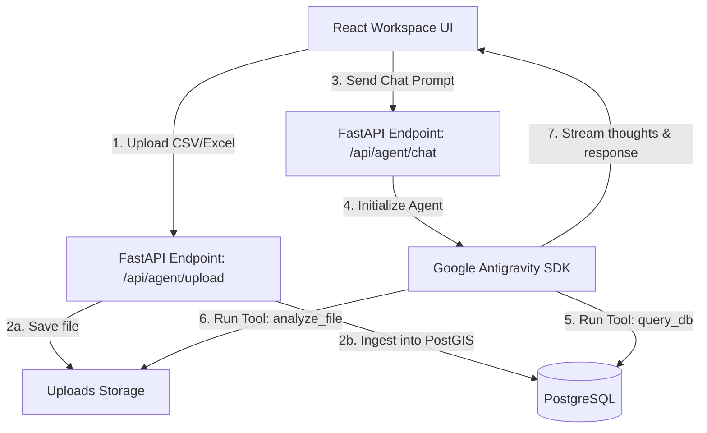

# Design Document: AI-Agentic Surveillance Control Center

## 1. Overview & Goals
This document outlines the design for transforming the Cholera Environmental Surveillance System into an interactive, **AI-agentic Workspace/Control Center**. 

Instead of a traditional static dashboard, the app will feature a multi-pane IDE-like layout that integrates:
- Interactive maps, charts, and reports (Main Viewer).
- An AI Copilot sidebar running the Google Antigravity SDK.
- A collapsible terminal/console displaying system logs, data ingestion traces, and the agent's internal "thoughts".
- A flexible drag-and-drop file ingestion flow for CSV/Excel data.

---

## 2. Architecture & Data Flow

### Components

#### A. Backend (FastAPI)
1. **Google Antigravity SDK**: Integrates a stateful `Agent` instance utilizing `gemini-3.5-flash` with the following custom tools:
   - `query_database(query_string)`: Safe read-only access to query current LGA risk scores, case counts, and environmental records.
   - `analyze_file(filename, prompt)`: Loads the uploaded file into pandas and runs descriptive statistical, time-series, or correlation analysis.
   - `get_satellite_status()`: Queries GEE or NASA GPM configurations.
2. **Stateful Conversation Router**: `/api/agent/chat` (streaming response, thoughts, and execution events).
3. **Ingestion Router**: `/api/agent/upload` handles ingestion into standard DB schemas while keeping the raw file referenced for ad-hoc agent analysis.

#### B. Frontend (React + Tailwind CSS)
1. **Workspace Layout**: 
   - **Left Column**: Navigation tabs (Dashboard, Map Only, Reports, Satellites, Settings).
   - **Center Column**: Main Viewer containing Leaflet map, Recharts charts, or detailed reports.
   - **Right Column (AI Copilot)**: Stateful chat thread with inline file attachment capabilities, showing conversation logs.
   - **Bottom Pane (System Console)**: A collapsible CLI-styled log window that displays real-time backend server logs, database query events, and streamed agent thoughts.

---

## 3. Detailed Component Design

### Ingestion Flow
1. User drops `CRS_2021_Cases.csv` into the chat sidebar.
2. Frontend uploads it to `/api/agent/upload`.
3. Backend:
   - Validates format and checks for schema matches.
   - Saves raw file to `backend/data/uploads/` with a unique ID.
   - Ingests records into the PostgreSQL database.
   - Starts a new agent conversation session, passing a system reference to the uploaded file.
4. Agent returns an initial descriptive analysis: "Ingested 18 records. Found 4 LGAs with case count spikes. Correlation with 7-day rainfall shows a 1.5-week lag..."

### Stateful Chat Loop
- REST SSE (Server-Sent Events) or WebSockets stream the agent's response.
- Special custom tags allow the frontend to parse the stream into two targets:
  - `<thought>...</thought>` blocks stream directly to the **System Console** at the bottom.
  - Standard text streams directly to the **Chat Thread** as the user response.

---

## 4. UI / UX Design System

- **Aesthetics**: Premium, high-tech dark theme console combined with a clean professional interface. Glassmorphism panel styling.
- **Typography**: Inter (UI labels, chat), JetBrains Mono/Fira Code (System Console terminal logs).
- **Transitions**: Smooth animations for collapsing the terminal, opening panels, and streaming text.

---

## 5. Verification Plan

### Automated Tests
- Test cases for agent tools (`query_database` and `analyze_file`) using mock data.
- API validation tests for `/api/agent/chat` and `/api/agent/upload`.

### Manual Verification
- Upload test case sheet (`Copy of Cholera Data for CRS 2021.xlsx`) and verify the initial analysis is generated correctly.
- Ask follow-up questions (e.g. "Calculate the Pearson correlation coefficient between rainfall and cholera cases in Ogoja") and check the returned statistics.
- Verify that streaming thoughts are outputted to the collapsible system console.
