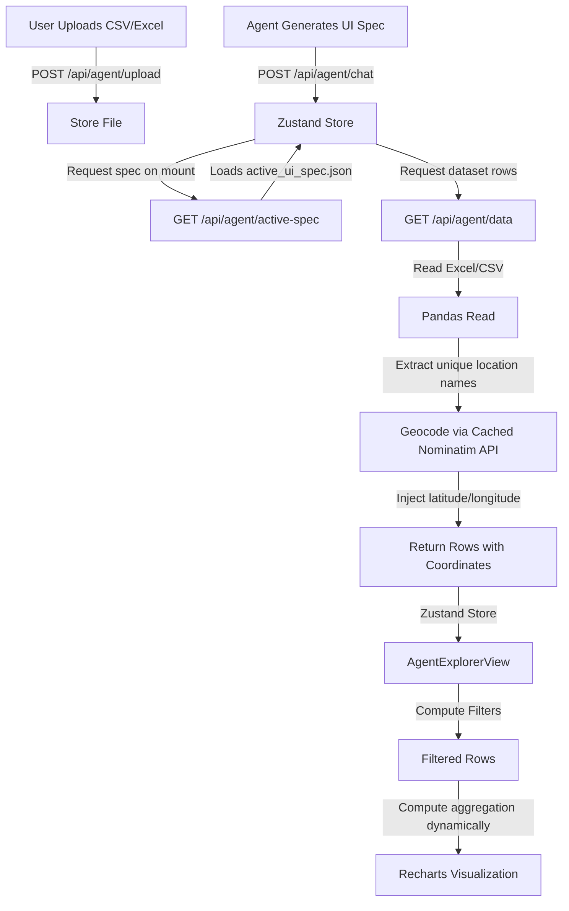

# Design Specification: Interactive Custom Dashboard Template (Agent Explorer)

**Date:** 2026-06-03  
**Status:** Pending Review  
**Objective:** Redesign and develop a robust, premium dashboard template in the **Agent Explorer** view. The dashboard must dynamically handle coordinate geocoding for any Nigerian LGA, aggregate dataset columns dynamically for charts, support global interactive filtering, and persist state across page reloads.

---

## 1. Architecture & Data Flow

---

## 2. Component Design & Changes

### A. Backend Integration (FastAPI)
1. **Endpoint `GET /api/agent/active-spec`**:
   * Reads and returns the contents of `backend/data/agent_uploads/active_ui_spec.json` (if it exists) to allow persistent state on reload.
2. **Endpoint `GET /api/agent/data`**:
   * Inspects the dataset for spatial coordinate columns (e.g., `latitude`, `longitude`, `lat`, `lng`).
   * If missing, searches for an LGA or location column (e.g., matching `"lga"`, `"region"`, `"state"`, `"location"`, `"area"`).
   * Extracts the unique location values. For each unique value:
     * Checks if coordinates exist in the local JSON cache (`backend/data/geocoding_cache.json`).
     * If not found, calls Nominatim geocoding: `https://nominatim.openstreetmap.org/search?q={lga},+Nigeria&format=json&limit=1` using a custom User-Agent.
     * Caches the coordinates in `geocoding_cache.json`.
   * Merges the geocoded coordinates back into each row of the dataset as `latitude` and `longitude` fields.

### B. Frontend Implementation (`AgentExplorerView.tsx` & `agentStore.ts`)
1. **Persistent Load on Mount**:
   * On mount, `AgentExplorerView` checks if `generatedUiSpec` is empty. If so, it dispatches a request to `/api/agent/active-spec` to fetch the cached spec and triggers a data fetch for the corresponding dataset.
2. **Global Interactive Filters**:
   * Identifies categorical columns (defined as columns containing string values with $< 15$ unique entries).
   * Renders a filters bar at the top of the dashboard (e.g., filter by LGA, Gender, Outcome, etc.).
   * Computes a filtered subset of rows (`filteredDataset`) using React `useMemo` hooks.
3. **Dynamic Client-Side Aggregation**:
   * Before feeding data to charts, groups rows by `xAxisKey`.
   * Calculates series values:
     * If the series key is numeric, aggregates using the specified method (`sum`, `avg`, `count`).
     * If the series key is non-numeric/categorical or matches the `xAxisKey`, calculates the count of rows matching that category (frequency mapping).
   * Removes duplicate x-axis values and returns aggregated records.
4. **UI Refinement**:
   * Replaces simple cards with a beautiful glassmorphic grid layout, consistent dark/light themes, material design icons, clean numeric formatting, and elegant hover animations.

---

## 3. Verification Plan

### Automated Verification
* Unit tests in `backend/tests/test_agent_router.py` to assert that:
  * `GET /api/agent/active-spec` returns 200 and the JSON spec if present.
  * `GET /api/agent/data` correctly injects coordinates for rows containing Nigeria LGA names (e.g., "Kano Municipal" or "Ogoja") when coordinates are missing in the raw file.
* React rendering check for coordinate mapping and dynamic aggregation.

### Manual Verification
* Upload `Copy of Cholera Data for CRS 2021.xlsx` and verify that the Map renders markers at the LGA centroids.
* Verify that charts (like "Cases by LGA") display aggregated frequencies instead of duplicate blank bars.
* Select a filter (e.g., gender "Male") and verify that all charts, maps, and KPIs recalculate instantly.
* Reload the browser page and verify that the custom dashboard re-renders immediately without showing the blank landing state.
